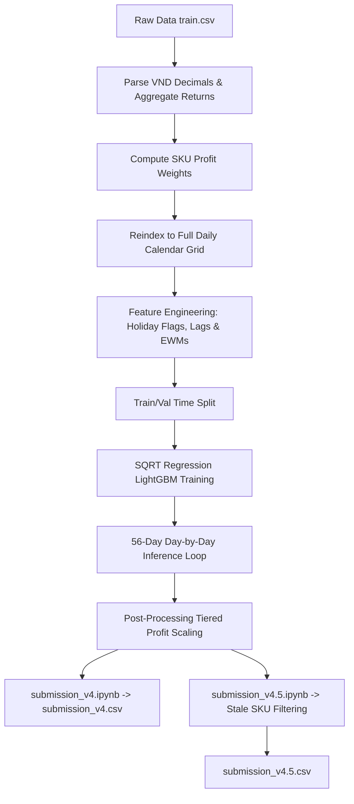

# Kaggle HBAAC 2026 — Vietnamese Auto Parts Demand Forecasting

This repository contains the top-performing solutions for the **Kaggle HBAAC 2026 Demand Forecasting** competition. 

The goal of this competition is to predict the daily sales quantity for the next 56 days across roughly **15,972 SKUs** of a Vietnamese Auto Parts distributor, based on ~5 years of transaction history (2020-11-17 to 2025-09-05). Predictions are evaluated using the **Weighted Root Mean Squared Scaled Error (WRMSSE)** metric.

---

## 📂 Repository Contents

This repository is configured to keep only the two final production-ready notebooks tracked in Git:

*   [submission_v4.ipynb](file:///d:/Repositories/kaggle_hbaac_2026/submission_v4.ipynb): Generates our baseline optimized LightGBM model forecasts, saving output to `/kaggle/working/submission_v4.csv` (**WRMSSE: ~0.5468**).
*   [submission_v4.5.ipynb](file:///d:/Repositories/kaggle_hbaac_2026/submission_v4.5.ipynb): Applies advanced data-driven post-processing (stale SKU zeroing) on top of the v4 model forecasts to avoid over-predicting on inactive items, saving output to `/kaggle/working/submission_v4.5.csv` (**WRMSSE: ~0.5402**).

---

## 🚀 Reproducibility Guide (How to Run)

### Option A: Running on Kaggle (Recommended)

To run the notebooks inside the Kaggle environment with no manual environment setup:

1.  **Create a New Notebook** in the Kaggle competition page for **HBAAC Round 2**.
2.  **Upload the Notebook**: File → Import Notebook → Upload `submission_v4.ipynb` or `submission_v4.5.ipynb`.
3.  **Verify Data Sources**: The competition dataset should automatically be mapped to `/kaggle/input/competitions/hbaac-round2`.
4.  **Run All Cells**: The notebook will execute the training and inference pipeline, outputting the respective submission CSV to `/kaggle/working/`.

---

### Option B: Running Locally

To run the notebooks on your local machine:

1.  **Clone the Repository** and ensure you have the required dependencies installed (see [Dependencies](#-python-dependencies) below).
2.  **Download the Dataset**: Download `train.csv` and `sample_submission.csv` from Kaggle and place them inside a data directory.
3.  **Adjust Paths**: Open the second cell of the notebook and adjust the `INPUT_DIR` and `OUTPUT_DIR` paths to match your local paths. For example:
    ```python
    INPUT_DIR  = Path('path/to/your/local/data/directory')
    OUTPUT_DIR = Path('path/to/save/outputs')
    ```
4.  **Run all cells** sequentially using a Jupyter Notebook/Lab server or VS Code.

---

## 🛠️ Solution Architecture & Pipeline



### 1. Data Preprocessing & Grid Alignment
*   **Returns Aggregation:** Negative quantities (customer returns) are aggregated and summed by day. The net daily quantity is then clipped at 0.
*   **Grid Expansion:** We expand the sparse daily transaction grain to a complete dense calendar grid (`MultiIndex` of all SKUs × all dates from 2020-11-17 to 2025-09-05). Dates with no sales are filled with `0` quantity.
*   **VND Parser:** Cleans Vietnamese decimal-comma strings in pricing (`UnitPrice`, `Unit Cost`) and converts them into floats.

### 2. Feature Engineering
We construct robust features specifically designed for retail demand forecasting:
*   **Vietnamese Holiday Windows:** Extended indicator flags covering public holidays (New Year, Kings' Commemoration, Reunification Day, Labor Day, National Day).
*   **Tet (Lunar New Year) Encodings:** Dynamic 9-day holiday window calculations mapping the moving date of Tet, days to next Tet, days since last Tet, and a Tet season active flag.
*   **Leak-Free Time Series Features:** Lags starting at a minimum of 56 days (matching our forecast horizon) to avoid data leakage (lags `56`, `63`, `70`, `84`, `91`, `357`, `364`, `371`).
*   **Rolling Aggregates & EWM:** Rolling mean, standard deviation, and Exponential Weighted Mean (spans `28`, `56`) to capture recency-biased trends.
*   **Croston-like Streak:** Active track of consecutive zero-sales days from the lag-56 perspective.

### 3. Model Training
*   **Target Transformation:** We train the model on the square root of the sales quantity ($\sqrt{\text{Quantity}}$) to stabilize variance and prevent extremely high spikes from dominating the loss. Predictions are squared back to the original scale during inference.
*   **Profit-Aware Sample Weights:** Training rows are weighted using $\frac{\text{profit}^{0.7}}{\sqrt{\text{naive\_denom}}}$, focusing training on highly profitable items while keeping representation for low-volume SKUs.
*   **Model Capacity:** A global LightGBM regression model trained with `num_leaves=255` and L2 regularization to capture complex interactive seasonal patterns.

### 4. Post-Processing & Tuning (v4 vs v4.5)
*   **Profit-Tier Scaling (v4 & v4.5):** To offset the regression model's tendency to underpredict high-volume sales peaks, we apply static scaling multipliers to the forecast based on SKU profit-weight quantiles:
    *   **Tier 1 (Top 5% profit):** Multiplied by `1.20`
    *   **Tier 2 (Top 5%-20% profit):** Multiplied by `1.10`
    *   **Tier 3 (Top 20%-50% profit):** Multiplied by `1.05`
*   **Stale SKU Filtering (v4.5 only):** 
    > [!IMPORTANT]
    > Thousands of SKUs in the dataset represent discontinued or stale inventory. To protect the RMSSE denominator, `submission_v4.5.ipynb` zeroes out forecasts for SKUs with high inactivity probabilities:
    > - SKUs with no sales in the last **365 days**.
    > - SKUs with no sales in the last **180 days** that also have low profit weights (`< 0.001`).
    > 
    > This reduces predictions on 16,978 stale rows, improving the validation WRMSSE score from `0.5468` to `0.5402`.

---

## 📦 Python Dependencies

The notebooks are designed to run in standard Kaggle Python environments. If running locally, please ensure the following libraries are installed:

```bash
pip install pandas numpy lightgbm scikit-learn matplotlib
```

*   `pandas >= 1.5.0`
*   `numpy >= 1.23.0`
*   `lightgbm >= 3.3.0`
*   `scikit-learn >= 1.0.0`
*   `matplotlib >= 3.5.0`
