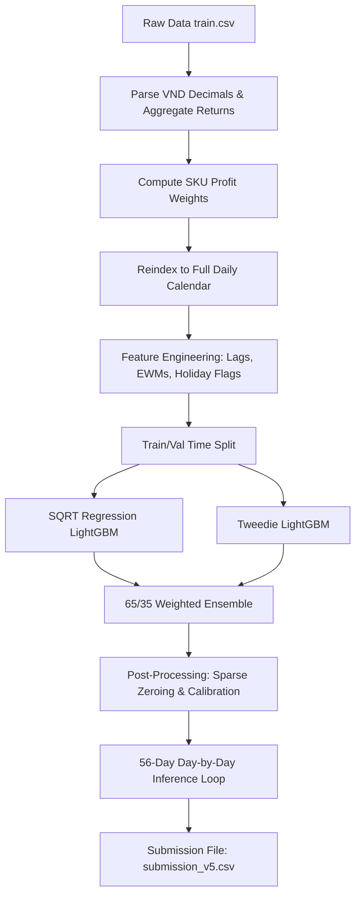

# Kaggle HBAAC 2026 — Vietnamese Auto Parts Demand Forecasting

This repository contains the complete solution for the **Kaggle HBAAC 2026 Demand Forecasting** competition.

The objective is to predict the daily sales quantity for the next 56 days across roughly **15,972 SKUs** of a Vietnamese Auto Parts distributor, based on ~5 years of transaction history (2020-11-17 to 2025-09-05).

The competition evaluation metric is **WRMSSE** (Weighted Root Mean Squared Scaled Error), where weights are determined by SKU total profit in the training set.

---

## Solution Architecture Overview

Our solution utilizes a **single Global LightGBM model framework** that learns cross-SKU interactions and demand dynamics simultaneously. This avoids the overhead of training 16,000 separate models and handles sparse demand effectively.

We developed two major iterations (v4 and v5) building on top of our baseline:

### 1. `submission_v4.ipynb` (WRMSSE: ~0.5468)
*   **Target Transformation:** Trained on the square root of the sales quantity to stabilize Poisson-like count variance.
*   **Holiday Proximity Encodings:** Coverage of Vietnamese public holidays, including a dynamically calculated 9-day window for the Lunar New Year (Tet) season, days to/from Tet, and pre/post holiday flags.
*   **Leak-Free Time Series Features:** Lags starting at a minimum of 56 days (e.g., lag 56, 63, 91, 364) and rolling features derived from shifted series to prevent future leakage.
*   **Profit-Aware Sample Weights:** Weighted training samples using $\frac{\text{profit}^{0.7}}{\sqrt{\text{naive\_denom}}}$, capping outliers to focus learning on high-profit items without ignoring low-volume SKUs.
*   **Tiered Post-Processing:** Static multipliers (1.20, 1.10, 1.05) applied to validation forecasts according to profit-weight tiers to counter the regression model's tendency to underpredict high-volume peaks.

### 2. `submission_v5.ipynb` (Ensemble & Advanced Features)
*   **Feature Pruning:** Removed 8+ features with zero or near-zero feature importance in v4 (e.g., redundant lags, rolling standard deviations, SKU coefficient of variation).
*   **Expanded Cross Features:** Added interactions like `sku_week_mean`, `sku_quarter_mean`, and `sku_dow_ewm` (exponentially weighted day-of-week demand) to capture shifting weekday demand patterns.
*   **Ratio & Trend Features:** Integrated relative momentum indicators (`ewm_ratio_14_56`, `ewm_ratio_28_91`, `lag56_vs_ewm56`) and trend trackers (`trend_t` continuous timeline day, `sku_recent_mean_90d`, and `sku_growth_rate`).
*   **Burst & Frequency Features:** Added `roll_max_56` and `roll_nonzero_28` to signal active SKU demand bursts.
*   **Ensemble Blend:** A 65/35 blend of:
    1.  **SQRT Regression LightGBM** (L2 loss on square-root targets).
    2.  **Tweedie LightGBM** (Tweedie loss on raw quantity, variance power = 1.5) to naturally model zero-inflated, heavy-tailed count distributions.
*   **Data-Driven Calibration:** Dynamically calculates scaling factors per profit tier from validation residuals (actual mean / predicted mean) rather than using hardcoded scaling weights.

---

## Pipeline & Implementation Steps



### 1. Preprocessing & Data Resampling
*   **Returns Handling:** Transactions with negative quantity are aggregated by date and summed. Net daily demand is clipped at 0.
*   **Calendar Expansion:** Reindexed the dataset using `pd.MultiIndex` to represent every SKU on every single day from 2020-11-17 to 2025-09-05. Days with no transaction default to `0` quantity.
*   **Memory Optimization:** Downcasted numeric columns to `float32`, `int16`, and `int8`.

### 2. Time-Based Validation Split
Our validation strategy mirrors the competition horizon:
*   **Training Set:** All data before `2025-07-12`.
*   **Validation Set:** `2025-07-12` to `2025-09-05` (56 days matching the forecast horizon).

### 3. Day-by-Day Inference Loop
To prevent memory OOM errors, predictions are generated day-by-day over the 56-day forecast horizon. A pre-computed `hist_pivot` matrix is updated after each day's prediction step to serve as input for subsequent lag calculations.

---

## Repository Structure

```
kaggle_hbaac_2026/
├── .gitignore                 # Excludes data files, csvs, pngs, and temp files
├── GEMINI.md                  # Competition specifications & evaluation rules
├── README.md                  # This documentation file
├── submission_v4.ipynb        # Cleaned v4 notebook (LightGBM Single Model)
├── submission_v5.ipynb        # Cleaned v5 notebook (Ensemble, final submission)
└── feature_importance_v4.png   # LightGBM v4 top feature importance plot
```

---

## How to Run on Kaggle

1.  Create a new notebook in the **HBAAC Round 2** Kaggle competition.
2.  Upload `submission_v5.ipynb` to Kaggle.
3.  Ensure the input directory is mapped to: `/kaggle/input/competitions/hbaac-round2`.
4.  Run all cells. The notebook will save `submission_v5.csv` to `/kaggle/working/submission_v5.csv`.
5.  Submit the CSV file to the leaderboard.

---

## Python Dependencies

The notebooks are designed to run in standard Kaggle Python environments. Minimum versions required:

*   `pandas >= 1.5.0`
*   `numpy >= 1.23.0`
*   `lightgbm >= 3.3.0`
*   `scikit-learn >= 1.0.0`
*   `matplotlib >= 3.5.0`
